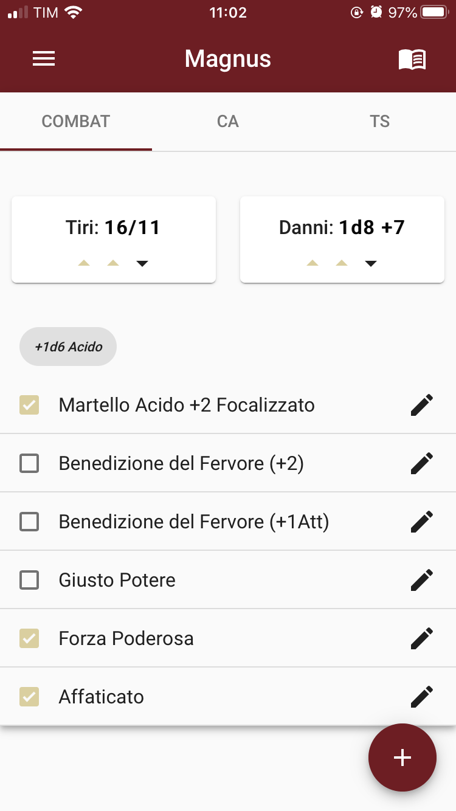
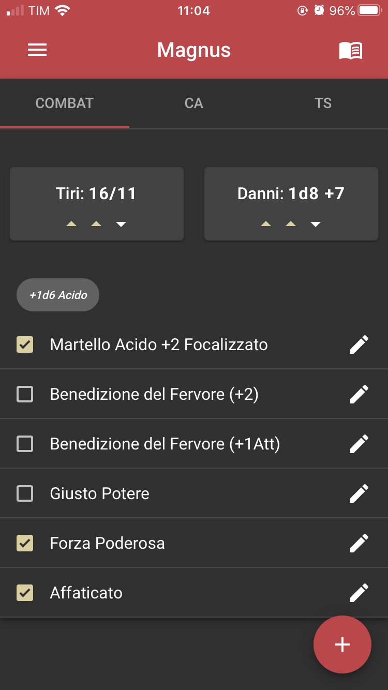
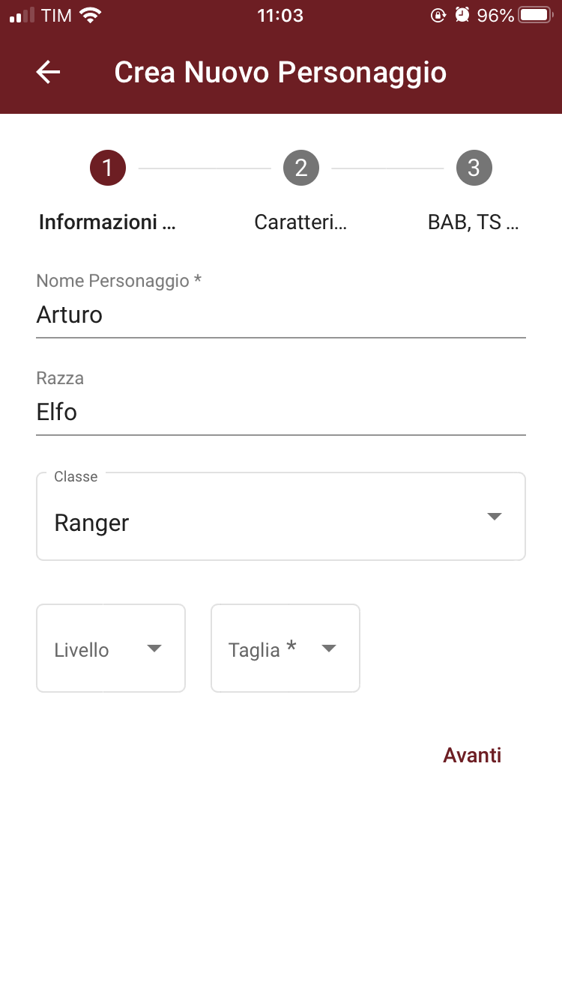
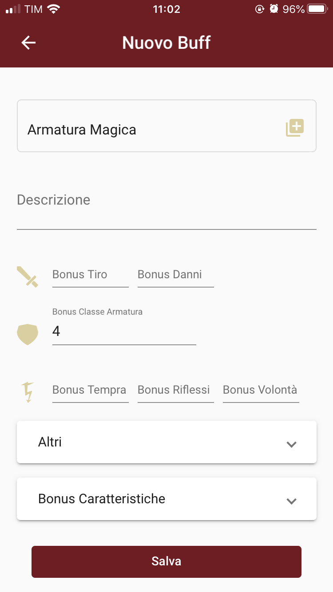

# RPG Combat Manager

## A cross-platform app to manage buffs in your DnD/Pathfinder adventures

DnD and Pathfinder are very complex games, especially when it comes to battles, since there are many active **buffs** to manage.
This app wants to help players with that aspect of the games by providing a way to **count** all **bonus/malus** and to add them to basic modifiers.

It allows to select a buff from a list and it provides _automatic updates_ for us.
It is divided into three principal tabs that represents the **attack** phase, the **defend** phase and the **saving throws** 
(during the battle) respectively.

The interface was designed following the **Material Design** rules (_Angular Material framework_ [1]), while the code was written in _typescript_ 
and it was built into an iOS/Android app with **Ionic** [2]. Here are some screenshots:

<div>
<p align="center">


</p>
<div/>

## How to install
The code has been developed and tested with:
- Ionic CLI 5.4.15
- Ionic Angular 4.11.8
- @angular-devkit/build-angular 0.801.3
- @angular-devkit/schematics 8.1.3
- @angular/cli 8.1.3
- @ionic/angular-toolkit 2.1.2
- Cordova CLI 9.0.0

After that you'll have to install all of the _npm_ dependencies. _Cordova_ is the real converter for Android/iOS [3].

### Browser
To play around with the *localhost* browser app, it is enough to run the following command in a terminal shell:
```
ionic serve
```

### Android
Once you've configured Android SDK (more information <a href="https://ionicframework.com/docs/installation/android">here</a>) for your OS,
you can build your `.apk` Android file with:
```
ionic cordova build android --prod
```

### iOS
It works only with MacOS. Cordova provides an XCode app building for you
(more information <a href="https://ionicframework.com/docs/installation/ios">here</a>).
Run:
```
ionic cordova prepare ios --prod 
```
Open the newly created project and build with XCode. You can run it with either an emulated or physical device.


## App features
This app was developed to help player during the battles of a D&D or a Pathfinder campaign, but _it does not_ replace the character sheet. However several features are implemented, so you can:

- **add your characters**, including characteristics and basic modifiers.
- **add custom buff** that will be included in specific buff lists.
- **select your actual buffs** during the battle to update in realtime and with no effort your actual combat statistics. 
- **visualize all/active buff list** whenever you want to.

<div>
<p align="center">


</p>
<div/>

## Known issues
- Automatic Dark Mode does not work on Android devices. 
- Also older Android devices have some visualization troubles and 
soft updating problems.

## References

[1] https://material.angular.io/

[2] https://ionicframework.com/

[3] https://cordova.apache.org/
